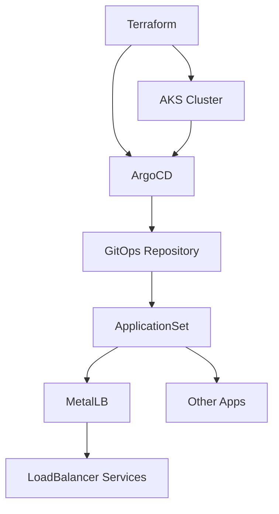

# Kubernetes Environment

This directory contains the Terraform configuration for the environment, including:
- AKS Kubernetes cluster
- ArgoCD for GitOps
- Automated application deployment via GitOps

## Quick Start

### Deploy Infrastructure
```bash
terraform plan
terraform apply
```

### Check Status
```bash
terraform output
```

## Post-Deployment Steps

1. **Add SSH Key to GitHub**
   - Copy the SSH public key from the deployment output
   - Add it to your GitOps repository settings (see output for URL)
   - Check "Allow write access" if needed

2. **Access ArgoCD**
   ```bash
   kubectl port-forward svc/argocd-server -n argocd 8080:80
   ```
   - URL: http://localhost:8080
   - Username: `admin`
   - Password: Use the command below to get it

## Useful Commands

```bash
# Setup kubectl
terraform output -raw cluster_credentials | bash

# Get ArgoCD password
kubectl -n argocd get secret argocd-initial-admin-secret -o go-template='{{printf "%s\n" (.data.password|base64decode)}}'

# Check applications
kubectl get applications -n argocd

# View all outputs
terraform output
```

## Architecture



### Components

- **AKS Cluster**: Azure Kubernetes Service provides the Kubernetes foundation
- **ArgoCD**: Deployed via Terraform, manages all subsequent applications
- **ApplicationSet**: Automatically discovers and deploys apps from GitOps repository
- **GitOps Applications**: All apps (including MetalLB) are deployed via GitOps commits

### GitOps Workflow

After the base infrastructure is deployed:
1. ArgoCD monitors the configured Git repository
2. ApplicationSet discovers application manifests
3. Applications are automatically deployed to the appropriate environment overlay
4. Changes are made by committing to the Git repository

## Files

- `main.tf` - Main Terraform configuration
- `variables.tf` - Variable definitions
- `outputs.tf` - Clean, formatted outputs
- `terraform.tfvars` - Environment-specific values

## Environment Configuration

The environment name is automatically detected from the directory name and used to:
- Tag all resources appropriately
- Select the correct Kustomization overlay in GitOps applications
- Configure environment-specific settings

## Notes

- Infrastructure components (AKS, ArgoCD) are managed by Terraform
- Applications (MetalLB, etc.) are managed via GitOps
- This separation allows for infrastructure stability while maintaining application flexibility
- `outputs.tf` - Clean, formatted outputs
- `terraform.tfvars` - Environment-specific values
