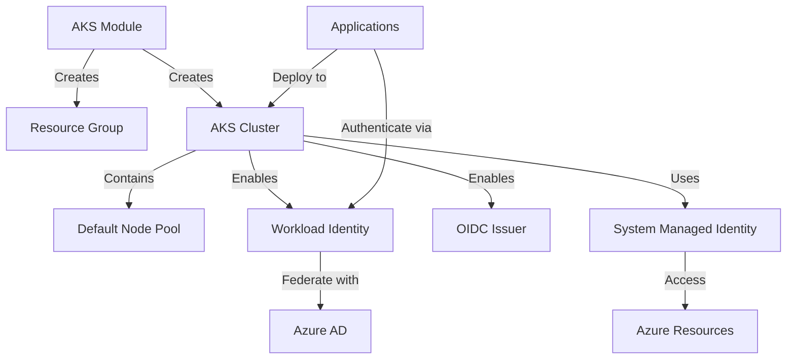

# Azure Kubernetes Service (AKS) Module

This Terraform module creates a production-ready Azure Kubernetes Service (AKS) cluster with workload identity support, system-assigned managed identity, and consistent resource naming using random pet names.

## Purpose

The `aks` module provides a simplified way to deploy AKS clusters with:
- Consistent and memorable resource naming
- Workload identity federation for secure Azure service integration
- System-assigned managed identity for cluster operations
- Flexible node pool configuration
- Security best practices enabled by default

## Architecture



## Features

- **Random Pet Naming**: Generates unique, memorable names for resources
- **Resource Group Management**: Creates dedicated resource group for cluster isolation
- **Workload Identity**: OIDC issuer enabled for pod-level Azure authentication
- **System Managed Identity**: Simplified identity management for cluster operations
- **Flexible Configuration**: Customizable node count, VM size, and location
- **Security Defaults**: Best practices enabled out of the box
- **Tag Management**: Consistent tagging across all resources

## Usage

### Basic Example

```hcl
module "aks" {
  source = "../../modules/aks"
  
  resource_group_location = "eastus"
  node_count             = 3
  vm_size                = "Standard_D2s_v3"
  
  common_tags = {
    Environment = "production"
    ManagedBy   = "Terraform"
  }
}
```

### Development Environment

```hcl
module "aks_dev" {
  source = "../../modules/aks"
  
  resource_group_location = "westus2"
  node_count             = 1
  vm_size                = "Standard_B2ms"  # Burstable for cost savings
  random_pet_length      = 2
  
  common_tags = {
    Environment = "development"
    CostCenter  = "engineering"
  }
}
```

### Production Environment

```hcl
module "aks_prod" {
  source = "../../modules/aks"
  
  resource_group_location = "eastus2"
  node_count             = 5
  vm_size                = "Standard_D4s_v3"
  random_pet_length      = 3  # Longer names for uniqueness
  
  common_tags = {
    Environment = "production"
    CostCenter  = "operations"
    Compliance  = "pci"
  }
}
```

### With Other Modules

```hcl
# AKS cluster
module "aks" {
  source = "../../modules/aks"
  
  resource_group_location = var.location
  node_count             = var.node_count
  vm_size                = var.vm_size
  common_tags            = var.tags
}

# ArgoCD for GitOps
module "argocd" {
  source = "../../modules/argocd"
  
  cluster_endpoint = module.aks.cluster_host
  # ... other configuration
  
  depends_on = [module.aks]
}

# Azure Key Vault for SOPS
module "akv_sops" {
  source = "../../modules/akv-sops"
  
  key_vault_name      = "kv-${module.aks.random_suffix}"
  location            = module.aks.resource_group_location
  resource_group_name = module.aks.resource_group_name
  oidc_issuer_url     = module.aks.cluster_oidc_issuer_url
  
  depends_on = [module.aks]
}
```

## Inputs

| Name | Description | Type | Default | Required |
|------|-------------|------|---------|:--------:|
| `resource_group_location` | Azure region for resources | `string` | `"northcentralus"` | no |
| `node_count` | Number of AKS nodes | `number` | `3` | no |
| `vm_size` | VM size for AKS nodes | `string` | `"Standard_B2ms"` | no |
| `random_pet_length` | Length of random pet name for resource naming | `number` | `2` | no |
| `common_tags` | Common tags to apply to all resources | `map(string)` | `{}` | no |

## Outputs

| Name | Description | Sensitive |
|------|-------------|:---------:|
| `cluster_name` | Generated AKS cluster name | no |
| `resource_group_name` | Generated resource group name | no |
| `resource_group_location` | Resource group location | no |
| `random_suffix` | Random pet suffix used for naming | no |
| `cluster_host` | Kubernetes cluster endpoint | yes |
| `cluster_client_certificate` | Kubernetes cluster client certificate | yes |
| `cluster_client_key` | Kubernetes cluster client key | yes |
| `cluster_ca_certificate` | Kubernetes cluster CA certificate | yes |
| `kube_config_raw` | Raw kubeconfig for the cluster | yes |
| `cluster_credentials_command` | Command to configure kubectl for this cluster | no |
| `cluster_identity_principal_id` | Principal ID of the cluster's system-assigned managed identity | no |
| `cluster_identity_tenant_id` | Tenant ID of the cluster's system-assigned managed identity | no |
| `cluster_oidc_issuer_url` | OIDC issuer URL for workload identity federation | no |

## Resource Naming

This module uses [random_pet](https://registry.terraform.io/providers/hashicorp/random/latest/docs/resources/pet) to generate unique, memorable names:

- **Resource Group**: `rg-{random-pet}`
- **AKS Cluster**: `aks-{random-pet}`
- **DNS Prefix**: `{random-pet}`

Example with `random_pet_length = 2`: 
- `rg-blessed-squid`
- `aks-blessed-squid`

## Node Pool Configuration

The module creates a default node pool with:
- **Name**: `default`
- **Temporary Name**: `temp` (for rotation operations)
- **VM Size**: Configurable via `vm_size`
- **Node Count**: Configurable via `node_count`

### VM Size Recommendations

| Environment | VM Size | vCPUs | Memory | Use Case |
|------------|---------|-------|---------|----------|
| Development | `Standard_B2ms` | 2 | 8 GB | Cost-effective, burstable |
| Testing | `Standard_D2s_v3` | 2 | 8 GB | Balanced performance |
| Production | `Standard_D4s_v3` | 4 | 16 GB | High performance |
| High Memory | `Standard_E4s_v3` | 4 | 32 GB | Memory-intensive workloads |

## Workload Identity

The module enables workload identity by default:
- **OIDC Issuer**: Enabled for federated authentication
- **Workload Identity**: Enabled for pod-level Azure integration

Use the `cluster_oidc_issuer_url` output to configure workload identity federation with Azure AD applications.

## Security Features

1. **System-Assigned Managed Identity**: Automatic identity management
2. **Workload Identity**: Pod-level authentication without secrets
3. **Network Isolation**: Each cluster in its own resource group
4. **RBAC**: Kubernetes RBAC enabled by default
5. **Latest Kubernetes**: Uses Azure's default (latest stable) version

## Post-Deployment Steps

1. **Configure kubectl**:
   ```bash
   $(terraform output -raw cluster_credentials_command)
   ```

2. **Verify cluster access**:
   ```bash
   kubectl get nodes
   ```

3. **Install essential components**:
   ```bash
   # Install ArgoCD for GitOps
   kubectl create namespace argocd
   kubectl apply -n argocd -f https://raw.githubusercontent.com/argoproj/argo-cd/stable/manifests/install.yaml
   ```

## Cost Optimization

- **Development**: Use `Standard_B2ms` (burstable) VMs
- **Auto-scaling**: Configure cluster autoscaler for production
- **Spot Instances**: Consider spot node pools for non-critical workloads
- **Resource Limits**: Set appropriate resource requests/limits on pods

## Troubleshooting

### Common Issues

1. **Name conflicts**: Increase `random_pet_length` for more unique names
2. **Quota limits**: Check Azure subscription quotas for the region
3. **Node pool updates**: Use the `temporary_name_for_rotation` for safe updates

### Debug Commands

```bash
# Get cluster info
az aks show -g $(terraform output -raw resource_group_name) -n $(terraform output -raw cluster_name)

# Check node pool status
az aks nodepool list -g $(terraform output -raw resource_group_name) --cluster-name $(terraform output -raw cluster_name)

# View cluster diagnostics
az aks get-upgrades -g $(terraform output -raw resource_group_name) -n $(terraform output -raw cluster_name)
```

## Requirements

- Terraform >= 1.0
- Azure Provider >= 3.0
- Azure CLI (for post-deployment configuration)
- kubectl (for cluster interaction)

## Related Documentation

- [Azure Kubernetes Service Documentation](https://docs.microsoft.com/en-us/azure/aks/)
- [AKS Best Practices](https://docs.microsoft.com/en-us/azure/aks/best-practices)
- [Workload Identity Federation](https://docs.microsoft.com/en-us/azure/active-directory/develop/workload-identity-federation)
- [AKS Pricing](https://azure.microsoft.com/en-us/pricing/details/kubernetes-service/)
