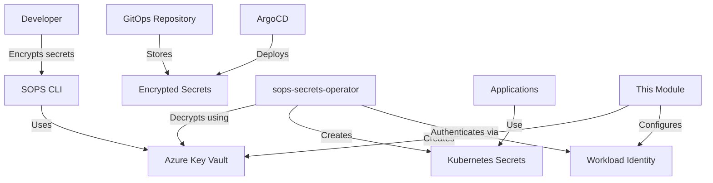

# Azure Key Vault SOPS Module

This Terraform module creates and configures Azure Key Vault for use with [SOPS](https://github.com/mozilla/sops) (Secrets OPerationS) encryption in Kubernetes environments. It provides secure secret encryption using Azure Key Vault with optional workload identity integration for the [sops-secrets-operator](https://github.com/isindir/sops-secrets-operator).

## Purpose

The `akv-sops` module enables GitOps-friendly secret management by:
- Creating an Azure Key Vault with RBAC authorization
- Generating RSA encryption keys for SOPS
- Setting up Azure AD workload identity for Kubernetes pods
- Providing configuration for the sops-secrets-operator via ConfigMap

## Architecture



## Features

- **Azure Key Vault Creation**: Secure key storage with RBAC authorization
- **SOPS Key Management**: RSA-2048 encryption key for SOPS operations
- **Workload Identity**: Optional Azure AD application for pod authentication
- **RBAC Configuration**: Flexible role assignments for Key Vault access
- **GitOps Integration**: ConfigMap output for operator configuration
- **Soft Delete Protection**: Configurable retention and purge protection

## Usage

### Basic Example

```hcl
module "akv_sops" {
  source = "../../modules/akv-sops"

  key_vault_name      = "kv-sops-${var.environment}"
  location            = var.location
  resource_group_name = azurerm_resource_group.main.name
  environment         = var.environment
  
  tags = {
    Environment = var.environment
    ManagedBy   = "Terraform"
  }
}
```

### With Workload Identity

```hcl
module "akv_sops" {
  source = "../../modules/akv-sops"

  key_vault_name      = "kv-sops-${var.environment}"
  location            = var.location
  resource_group_name = azurerm_resource_group.main.name
  environment         = var.environment
  
  # Enable workload identity for sops-secrets-operator
  create_workload_identity      = true
  workload_identity_name        = "sops-operator-${var.environment}"
  workload_identity_description = "Workload identity for SOPS secrets operator"
  oidc_issuer_url              = module.aks.oidc_issuer_url
  
  tags = {
    Environment = var.environment
    ManagedBy   = "Terraform"
  }
}
```

### With Additional RBAC Assignments

```hcl
module "akv_sops" {
  source = "../../modules/akv-sops"

  key_vault_name      = "kv-sops-${var.environment}"
  location            = var.location
  resource_group_name = azurerm_resource_group.main.name
  environment         = var.environment
  
  # Grant additional users/groups access
  rbac_assignments = {
    devops_team = {
      principal_id         = data.azuread_group.devops.object_id
      role_definition_name = "Key Vault Crypto User"
    }
    ci_pipeline = {
      principal_id         = azuread_service_principal.ci.object_id
      role_definition_name = "Key Vault Secrets User"
    }
  }
  
  tags = {
    Environment = var.environment
    ManagedBy   = "Terraform"
  }
}
```

## Inputs

| Name | Description | Type | Default | Required |
|------|-------------|------|---------|:--------:|
| `key_vault_name` | Name of the Azure Key Vault | `string` | n/a | yes |
| `location` | Azure region for resources | `string` | n/a | yes |
| `resource_group_name` | Name of the Azure resource group | `string` | n/a | yes |
| `environment` | Environment name (e.g., dev, stage, prod) | `string` | n/a | yes |
| `key_name` | Name of the SOPS encryption key | `string` | `"sops-key"` | no |
| `tags` | Resource tags | `map(string)` | `{}` | no |
| `soft_delete_retention_days` | Soft delete retention in days | `number` | `7` | no |
| `purge_protection_enabled` | Enable purge protection | `bool` | `false` | no |
| `rbac_assignments` | Additional RBAC role assignments | `map(object)` | `{}` | no |
| `create_workload_identity` | Create workload identity resources | `bool` | `false` | no |
| `workload_identity_name` | Name for workload identity | `string` | `""` | no |
| `workload_identity_description` | Description for workload identity | `string` | `""` | no |
| `oidc_issuer_url` | OIDC issuer URL from Kubernetes cluster | `string` | `""` | no |
| `workload_identity_subject` | Subject for federated identity | `string` | `"system:serviceaccount:..."` | no |

## Outputs

| Name | Description |
|------|-------------|
| `key_vault_id` | ID of the Azure Key Vault |
| `key_vault_name` | Name of the Azure Key Vault |
| `key_vault_uri` | URI of the Azure Key Vault |
| `key_id` | ID of the SOPS encryption key |
| `key_name` | Name of the SOPS encryption key |
| `key_version` | Version of the SOPS encryption key |
| `sops_azure_kv_url` | Full Azure Key Vault URL for SOPS configuration |
| `workload_identity_client_id` | Azure AD application client ID for workload identity |
| `service_principal_object_id` | Object ID of the service principal |
| `workload_identity_configuration` | Configuration values for GitOps setup |

## Integration with sops-secrets-operator

This module creates a ConfigMap named `sops-workload-identity` in the `sops-secrets-operator` namespace containing:
- `client_id`: Azure AD application client ID
- `tenant_id`: Azure tenant ID
- `key_vault_url`: Full URL for SOPS encryption
- `key_vault_name`: Name of the Key Vault
- `key_vault_uri`: Base URI of the Key Vault

The sops-secrets-operator can reference this ConfigMap for authentication configuration.

## Encrypting Secrets

After deploying this module, you can encrypt secrets using:

```bash
# Get the Key Vault URL
export SOPS_AZURE_KV=$(kubectl get configmap -n sops-secrets-operator sops-workload-identity -o jsonpath='{.data.key_vault_url}')

# Encrypt a secret
sops -e --azure-kv "$SOPS_AZURE_KV" secret.yaml > secret.enc.yaml
```

Or use the provided helper script:
```bash
source /path/to/gitops/scripts/sops-helpers.sh
sops-encrypt secret.yaml
```

## Security Considerations

1. **RBAC Authorization**: This module uses Azure RBAC instead of access policies (modern approach)
2. **Workload Identity**: Provides pod-level authentication without storing credentials
3. **Soft Delete**: Protects against accidental key deletion
4. **Encryption at Rest**: All secrets are encrypted in Azure Key Vault
5. **Audit Logging**: Key Vault operations are logged for compliance

## Requirements

- Terraform >= 1.0
- Azure Provider >= 3.0
- Azure AD Provider >= 2.0
- An existing AKS cluster (for workload identity)
- SOPS CLI installed locally (for encryption)

## Related Documentation

- [SOPS Documentation](https://github.com/mozilla/sops)
- [sops-secrets-operator](https://github.com/isindir/sops-secrets-operator)
- [Azure Key Vault Documentation](https://docs.microsoft.com/en-us/azure/key-vault/)
- [Azure Workload Identity](https://azure.github.io/azure-workload-identity/)
