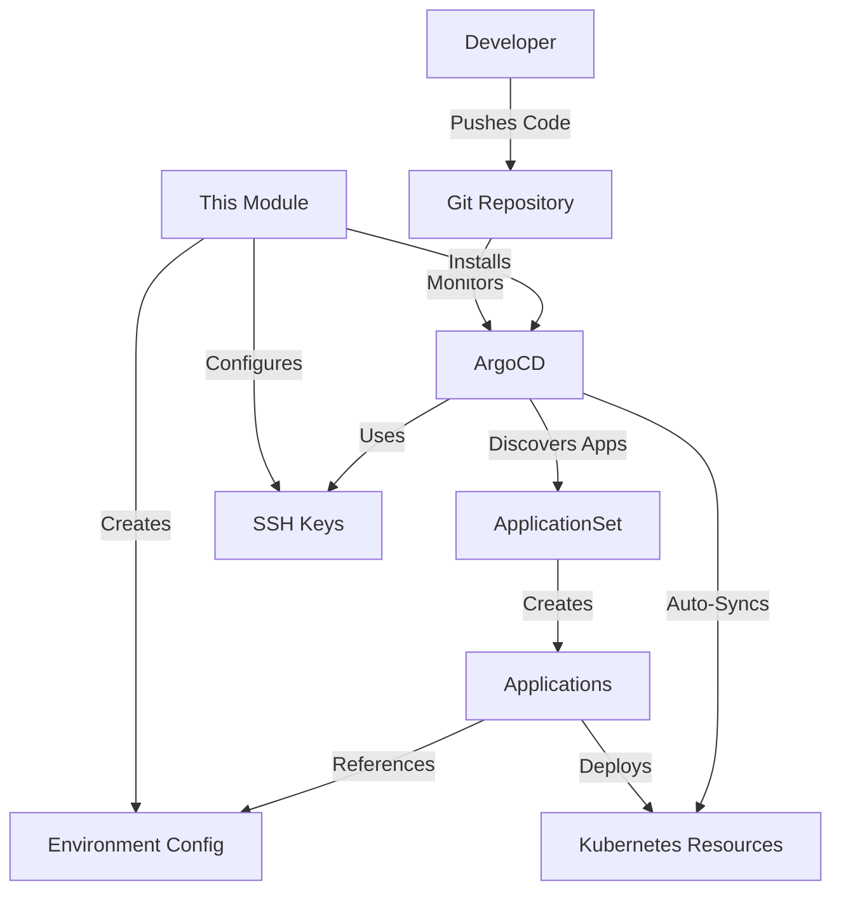

# ArgoCD Module

This Terraform module deploys and configures [ArgoCD](https://argo-cd.readthedocs.io/) for GitOps-based continuous delivery on Kubernetes clusters. It provides automatic application discovery, SSH key management for private repositories, and environment-specific configurations.

## Purpose

The `argocd` module enables GitOps workflows by:
- Installing ArgoCD with production-ready defaults
- Automatically discovering and deploying applications from Git repositories
- Managing SSH keys for secure private repository access
- Providing environment-specific application configurations
- Enabling automated synchronization and self-healing

## Architecture



## Features

- **Helm-based Installation**: Deploys ArgoCD using the official Helm chart
- **SSH Key Generation**: Automatically creates ED25519 SSH keys for repository access
- **ApplicationSet Discovery**: Scans Git directories to automatically create applications
- **Environment Isolation**: Deploys applications to environment-specific overlays
- **Automated Sync**: Configurable sync policies with pruning and self-healing
- **Namespace Management**: Creates dedicated ArgoCD namespace with proper isolation
- **Repository Configuration**: Supports both HTTPS and SSH Git access

## Usage

### Basic Example

```hcl
module "argocd" {
  source = "../../modules/argocd"
  
  environment  = "production"
  git_repo_url = "https://github.com/yourorg/gitops.git"
}
```

### Private Repository with SSH

```hcl
module "argocd" {
  source = "../../modules/argocd"
  
  environment     = "staging"
  git_repo_url    = "https://github.com/yourorg/gitops-private.git"
  use_ssh_for_git = true
  
  # The module will output a public key to add as a deploy key
}
```

### Custom ArgoCD Configuration

```hcl
module "argocd" {
  source = "../../modules/argocd"
  
  environment          = "development"
  git_repo_url         = "https://github.com/yourorg/gitops.git"
  argocd_chart_version = "5.51.6"
  
  # Custom ArgoCD values
  argocd_values = {
    server = {
      service = {
        type = "LoadBalancer"  # Expose ArgoCD UI
      }
      extraArgs = ["--insecure"]
      ingress = {
        enabled = true
        hosts   = ["argocd.example.com"]
      }
    }
    configs = {
      params = {
        "server.disable.auth" = false
      }
    }
  }
  
  # Custom sync policy
  sync_policy = {
    automated = {
      prune    = true
      selfHeal = true
      allowEmpty = false
    }
    retry = {
      limit = 5
      backoff = {
        duration = "5s"
        factor   = 2
        maxDuration = "3m"
      }
    }
    syncOptions = [
      "CreateNamespace=true",
      "PrunePropagationPolicy=foreground"
    ]
  }
}
```

### Multiple Application Directories

```hcl
module "argocd" {
  source = "../../modules/argocd"
  
  environment = "production"
  git_repo_url = "https://github.com/yourorg/gitops.git"
  
  # Discover apps from multiple directories
  app_discovery_directories = [
    { path = "apps/*" },           # Core applications
    { path = "infrastructure/*" }, # Infrastructure components
    { path = "monitoring/*" }      # Monitoring stack
  ]
}
```

### Integration with Other Modules

```hcl
# Deploy AKS cluster
module "aks" {
  source = "../../modules/aks"
  
  resource_group_location = var.location
  node_count             = 3
}

# Deploy ArgoCD
module "argocd" {
  source = "../../modules/argocd"
  
  environment  = var.environment
  git_repo_url = var.gitops_repo_url
  
  depends_on = [module.aks]
}

# Deploy SOPS for secret management
module "akv_sops" {
  source = "../../modules/akv-sops"
  
  key_vault_name      = "kv-${module.aks.random_suffix}"
  location            = module.aks.resource_group_location
  resource_group_name = module.aks.resource_group_name
  
  depends_on = [module.aks]
}
```

## Inputs

| Name | Description | Type | Default | Required |
|------|-------------|------|---------|:--------:|
| `environment` | Environment name (e.g., dev, stage, prod) | `string` | n/a | yes |
| `git_repo_url` | Git repository URL for ArgoCD applications | `string` | `"https://github.com/unixfg/kubernetes.git"` | no |
| `git_revision` | Git revision/branch to track | `string` | `"HEAD"` | no |
| `use_ssh_for_git` | Whether to use SSH for git repository access | `bool` | `true` | no |
| `argocd_repo_ssh_secret_name` | Name of the Kubernetes Secret to store SSH key | `string` | `"argocd-repo-ssh"` | no |
| `argocd_chart_version` | ArgoCD Helm chart version | `string` | `null` (latest) | no |
| `argocd_project` | ArgoCD project for applications | `string` | `"default"` | no |
| `argocd_values` | ArgoCD Helm chart values | `any` | See defaults | no |
| `app_discovery_directories` | Directories to scan for applications | `list(object)` | `[{ path = "apps/*" }]` | no |
| `sync_policy` | ArgoCD sync policy configuration | `any` | See defaults | no |
| `create_applicationset` | Whether to create the ApplicationSet | `bool` | `true` | no |

## Outputs

| Name | Description |
|------|-------------|
| `argocd_namespace` | ArgoCD namespace name |
| `argocd_repo_public_key` | Public SSH key for repository access (add as deploy key) |
| `argocd_port_forward_command` | Command to access ArgoCD UI via port forwarding |
| `argocd_secret_name` | Name of the repository SSH secret |

## Post-Deployment Steps

### 1. Add Deploy Key (for private repositories)

If using SSH for Git access, add the public key to your repository:

```bash
# Get the public key
terraform output -raw argocd_repo_public_key

# Add to GitHub: Settings → Deploy keys → Add deploy key
# Add to GitLab: Settings → Repository → Deploy keys
# Add to Bitbucket: Repository settings → Access keys
```

### 2. Access ArgoCD UI

```bash
# Port forward to access UI
$(terraform output -raw argocd_port_forward_command)

# Get admin password
kubectl -n argocd get secret argocd-initial-admin-secret -o jsonpath="{.data.password}" | base64 -d

# Access UI at http://localhost:8080
# Username: admin
# Password: (from above command)
```

### 3. Configure CLI

```bash
# Install ArgoCD CLI
brew install argocd  # macOS
# or
curl -sSL -o /usr/local/bin/argocd https://github.com/argoproj/argo-cd/releases/latest/download/argocd-linux-amd64

# Login
argocd login localhost:8080 --username admin --password $(kubectl -n argocd get secret argocd-initial-admin-secret -o jsonpath="{.data.password}" | base64 -d)

# List applications
argocd app list
```

## Application Directory Structure

The module expects applications to follow this structure in your Git repository:

```
gitops-repo/
├── apps/
│   ├── app1/
│   │   ├── base/
│   │   │   ├── deployment.yaml
│   │   │   ├── service.yaml
│   │   │   └── kustomization.yaml
│   │   └── overlays/
│   │       ├── dev/
│   │       │   └── kustomization.yaml
│   │       ├── stage/
│   │       │   └── kustomization.yaml
│   │       └── prod/
│   │           └── kustomization.yaml
│   └── app2/
│       └── ... (same structure)
└── infrastructure/
    └── ... (optional additional apps)
```

## Security Considerations

1. **SSH Key Management**: Keys are generated per deployment and stored in Kubernetes secrets
2. **Repository Access**: Use deploy keys with read-only access for security
3. **RBAC**: ArgoCD has full cluster access by default; consider restricting in production
4. **Network Policies**: Consider implementing network policies to restrict ArgoCD traffic
5. **Secret Management**: Use external secret operators (like SOPS) for sensitive data

## Sync Policy Options

The module supports various sync options:

```hcl
sync_policy = {
  automated = {
    prune      = true    # Delete resources not in Git
    selfHeal   = true    # Revert manual changes
    allowEmpty = false   # Prevent syncing empty directories
  }
  syncOptions = [
    "CreateNamespace=true",              # Create namespaces if missing
    "PrunePropagationPolicy=foreground", # Wait for deletions
    "PruneLast=true",                   # Delete resources after others
    "RespectIgnoreDifferences=true",    # Respect .argocd-ignore
    "ApplyOutOfSyncOnly=true"           # Only sync changed resources
  ]
}
```

## Troubleshooting

### Common Issues

1. **ApplicationSet not creating apps**
   - Check Git repository access
   - Verify directory structure matches pattern
   - Check ArgoCD logs: `kubectl logs -n argocd deployment/argocd-applicationset-controller`

2. **SSH authentication failing**
   - Ensure deploy key is added to repository
   - Check secret contains correct SSH key
   - Verify repository URL format

3. **Sync failures**
   - Check application logs: `argocd app logs <app-name>`
   - Verify manifests are valid: `kubectl apply --dry-run=client -f manifest.yaml`
   - Check RBAC permissions

### Debug Commands

```bash
# Check ArgoCD components
kubectl get all -n argocd

# View application status
kubectl get applications -n argocd

# Check ApplicationSet
kubectl describe applicationset -n argocd app-discovery

# View ArgoCD logs
kubectl logs -n argocd deployment/argocd-server
kubectl logs -n argocd deployment/argocd-repo-server
kubectl logs -n argocd deployment/argocd-applicationset-controller

# Test repository access
kubectl exec -n argocd deployment/argocd-repo-server -- argocd-repo-server test-repo <repo-url>
```

## Best Practices

1. **Use Overlays**: Separate base configurations from environment-specific settings
2. **Implement Progressive Rollouts**: Deploy to dev → stage → prod
3. **Resource Limits**: Set appropriate resource requests/limits for ArgoCD components
4. **Monitoring**: Enable Prometheus metrics for ArgoCD monitoring
5. **Backup**: Regularly backup ArgoCD configurations and secrets

## Requirements

- Terraform >= 1.0
- Kubernetes Provider ~> 2.0
- Helm Provider ~> 2.0
- TLS Provider ~> 4.0
- Working Kubernetes cluster with admin access

## Related Documentation

- [ArgoCD Documentation](https://argo-cd.readthedocs.io/)
- [ApplicationSet Documentation](https://argocd-applicationset.readthedocs.io/)
- [Kustomize Documentation](https://kustomize.io/)
- [GitOps Principles](https://www.gitops.tech/)
- [Terraform Helm Provider](https://registry.terraform.io/providers/hashicorp/helm/latest/docs)