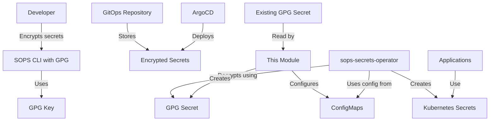

# K3s SOPS Module

This Terraform module configures GPG-based secret encryption for [SOPS](https://github.com/mozilla/sops) (Secrets OPerationS) in Kubernetes environments. It reads GPG keys from an existing Kubernetes secret and provides secure secret encryption for the [sops-secrets-operator](https://github.com/isindir/sops-secrets-operator).

## Purpose

The `k3s-sops` module enables GitOps-friendly secret management by:
- Reading GPG keys from an existing Kubernetes secret
- Creating SOPS operator-compatible secrets with GPG keys
- Providing configuration ConfigMaps for the sops-secrets-operator
- Generating SOPS creation rules for encryption workflows

## Architecture



## Features

- **GPG Key Management**: Reads existing GPG keys from Kubernetes secrets
- **SOPS Integration**: Creates operator-compatible secrets and configuration
- **Flexible Configuration**: Configurable secret names and namespaces
- **GitOps Ready**: Provides ConfigMaps for operator consumption
- **Creation Rules**: Generates SOPS creation rules automatically
- **Environment Support**: Multi-environment configuration support

## Usage

### Basic Example

```hcl
module "k3s_sops" {
  source = "../../modules/k3s-sops"

  gpg_secret_name      = "my-gpg-keys"
  gpg_secret_namespace = "default"
  environment          = var.environment
  gpg_fingerprint      = "ABCD1234EFGH5678IJKL9012MNOP3456QRST7890"
}
```

### With Custom Configuration

```hcl
module "k3s_sops" {
  source = "../../modules/k3s-sops"

  gpg_secret_name         = "sops-gpg-keys"
  gpg_secret_namespace    = "kube-system"
  gpg_private_key_field   = "private.key"
  gpg_public_key_field    = "public.key"
  sops_operator_namespace = "sops-system"
  environment             = var.environment
  gpg_fingerprint         = "ABCD1234EFGH5678IJKL9012MNOP3456QRST7890"

  create_sops_config = true

  tags = {
    Environment = var.environment
    ManagedBy   = "Terraform"
  }
}
```

### Prerequisites

Before using this module, ensure you have a Kubernetes secret containing your GPG keys:

```bash
# Create GPG keys if you don't have them
gpg --batch --full-generate-key <<EOF
Key-Type: RSA
Key-Length: 4096
Subkey-Type: RSA
Subkey-Length: 4096
Name-Real: SOPS Encryption
Name-Email: sops@example.com
Expire-Date: 0
%no-protection
%commit
EOF

# Export keys
gpg --export-secret-keys --armor sops@example.com > private.asc
gpg --export --armor sops@example.com > public.asc

# Create Kubernetes secret
kubectl create secret generic my-gpg-keys \
  --from-file=private.asc=private.asc \
  --from-file=public.asc=public.asc \
  --namespace=default
```

## Inputs

| Name | Description | Type | Default | Required |
|------|-------------|------|---------|:--------:|
| `gpg_secret_name` | Name of the Kubernetes secret containing GPG keys | `string` | n/a | yes |
| `gpg_secret_namespace` | Namespace of the Kubernetes secret containing GPG keys | `string` | n/a | yes |
| `environment` | Environment name (e.g., dev, stage, prod) | `string` | n/a | yes |
| `gpg_private_key_field` | Field name in the secret containing the GPG private key | `string` | `"private.asc"` | no |
| `gpg_public_key_field` | Field name in the secret containing the GPG public key | `string` | `"public.asc"` | no |
| `gpg_fingerprint` | GPG key fingerprint for SOPS configuration | `string` | `""` | no |
| `sops_operator_namespace` | Namespace where SOPS secrets operator is deployed | `string` | `"sops-secrets-operator"` | no |
| `create_sops_config` | Create SOPS configuration file as ConfigMap | `bool` | `true` | no |
| `tags` | Resource tags to apply to ConfigMaps and Secrets | `map(string)` | `{}` | no |

## Outputs

| Name | Description |
|------|-------------|
| `gpg_fingerprint` | GPG key fingerprint for SOPS configuration |
| `gpg_secret_name` | Name of the source GPG secret |
| `gpg_secret_namespace` | Namespace of the source GPG secret |
| `sops_gpg_secret_name` | Name of the GPG secret created for SOPS operator |
| `sops_operator_namespace` | Namespace where SOPS operator resources are created |
| `sops_config_name` | Name of the SOPS configuration ConfigMap |
| `sops_creation_rules` | SOPS creation rules in JSON format |
| `sops_configuration` | Complete SOPS configuration for GitOps consumption |

## Integration with sops-secrets-operator

This module creates the following resources for the sops-secrets-operator:

1. **sops-gpg-keys**: Secret containing the GPG private and public keys
2. **sops-gpg-config**: ConfigMap with GPG configuration and metadata
3. **sops-config**: ConfigMap with `.sops.yaml` configuration (optional)

The operator can reference these resources for automatic decryption of SOPS-encrypted secrets.

## Encrypting Secrets

After deploying this module, you can encrypt secrets using:

```bash
# Get the GPG fingerprint
export GPG_FINGERPRINT=$(kubectl get configmap -n sops-secrets-operator sops-gpg-config -o jsonpath='{.data.gpg_fingerprint}')

# Encrypt a secret
sops -e --pgp "$GPG_FINGERPRINT" secret.yaml > secret.enc.yaml
```

Or create a `.sops.yaml` file:

```yaml
creation_rules:
  - pgp: ABCD1234EFGH5678IJKL9012MNOP3456QRST7890
```

Then simply:
```bash
sops -e secret.yaml > secret.enc.yaml
```

## Security Considerations

1. **Key Protection**: GPG private keys are stored in Kubernetes secrets
2. **Namespace Isolation**: Keys are copied to the SOPS operator namespace
3. **Access Control**: Use RBAC to control access to GPG secrets
4. **Key Rotation**: Update the source secret and re-apply the module
5. **Backup**: Ensure GPG keys are backed up securely

## Requirements

- Terraform >= 1.0
- Kubernetes Provider >= 2.0
- An existing Kubernetes cluster (k3s, k8s, etc.)
- Existing Kubernetes secret with GPG keys
- SOPS CLI installed locally (for encryption)

## Related Documentation

- [SOPS Documentation](https://github.com/mozilla/sops)
- [sops-secrets-operator](https://github.com/isindir/sops-secrets-operator)
- [GPG Documentation](https://gnupg.org/documentation/)
- [K3s Documentation](https://docs.k3s.io/)